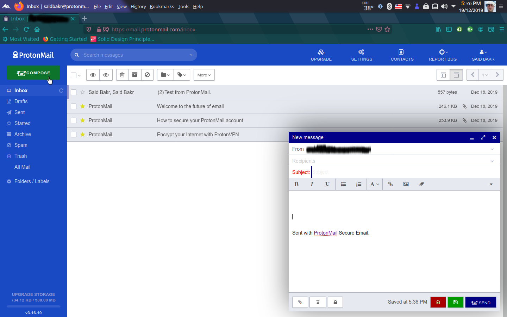

# protonmail-theme
CSS to customize ProtonMail web client theme
## Installation
Copy the css code found in any CSS file in the repo. and paste it Custom Theme textarea as described below:
 
 1. Login to your [ProtonMail](https://mail.protonmail.com/login) account.
 2. Click on the **SETTINGS** link on the top horizontal navigation bar.
 3. Click on **Appearance** link on the left vertical navigation bar.
 4. Scroll down to section named **Custom theme**.
 5. Copy the CSS code found in any CSS file you chose in the repo. nd paste it in the textarea in **Custom theme** section.
 6. Click the button **SAVE**.
 
 
 
